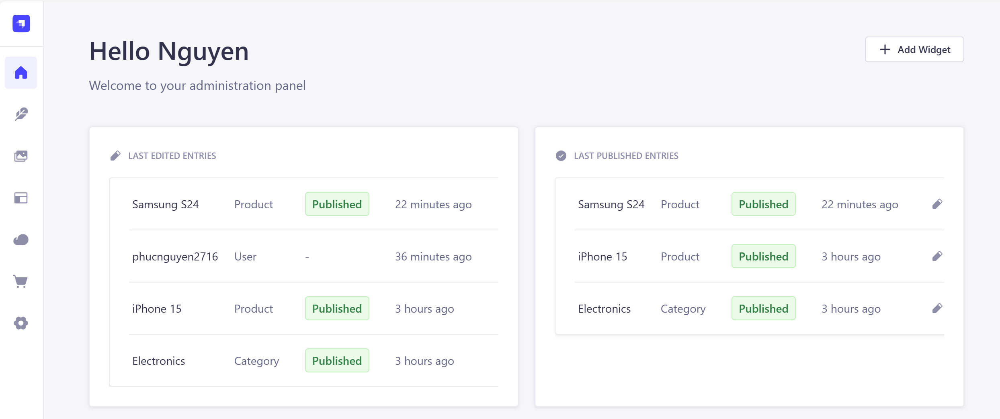
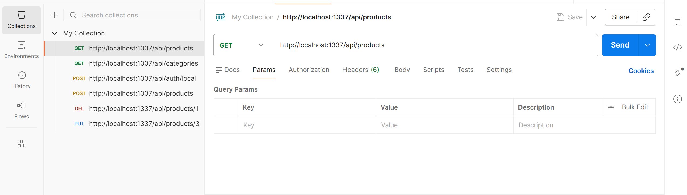

# 🛒 E-Commerce Backend API (Strapi)

This project is a simple E-Commerce backend built using **Strapi (Headless CMS)**.  
It provides RESTful APIs for managing **Category** and **Product** with full CRUD operations.

---

# 🚀 Technologies Used

- Strapi (Headless CMS)
- Node.js
- RESTful API
- SQLite (default) / MySQL
- Postman (API Testing)

---

# 📁 Project Structure

```
E-COMMERCE
│── config
│── database
│── public
│── src
│── .env
│── package.json
│── README.md
```

---

# ⚙️ Installation & Setup

## 1️⃣ Clone repository

```
git clone https://github.com/your-username/your-repo-name.git
cd your-repo-name
```

## 2️⃣ Install dependencies

```
npm install
```

## 3️⃣ Run development server

```
npm run develop
```

Strapi will run at:

```
http://localhost:1337
```

---

# 🖥 Admin Panel (Strapi)

After running the server:

- Open: `http://localhost:1337/admin`
- Create an admin account
- Create Collection Types:
  - Category
  - Product

You can manage all data directly from the Admin Panel.

📷 Example Admin UI:



---

# 🗂 Data Models

## 1️⃣ Category

Fields:
- name (string)
- description (text)

Relationship:
- One Category has many Products (One-to-Many)

---

## 2️⃣ Product

Fields:
- name (string)
- price (number)
- description (text)
- category (relation → Category)

---

# 📦 Category API (CRUD)

Base URL:

```
http://localhost:1337/api/categories
```

---

## ✅ Create Category

**POST**
```
/api/categories
```

Body:
```json
{
  "data": {
    "name": "Electronics",
    "description": "Electronic devices"
  }
}
```

---

## ✅ Get All Categories

**GET**
```
/api/categories
```

---

## ✅ Get Category By ID

**GET**
```
/api/categories/1
```

---

## ✅ Update Category

**PUT**
```
/api/categories/1
```

Body:
```json
{
  "data": {
    "name": "Updated Electronics"
  }
}
```

---

## ✅ Delete Category

**DELETE**
```
/api/categories/1
```

---

# 🛒 Product API (CRUD)

Base URL:

```
http://localhost:1337/api/products
```

---

## ✅ Create Product

**POST**
```
/api/products
```

Body:
```json
{
  "data": {
    "name": "iPhone 15",
    "price": 1000,
    "description": "Latest Apple smartphone",
    "category": 1
  }
}
```

---

## ✅ Get All Products

**GET**
```
/api/products?populate=*
```

`populate=*` is used to retrieve related Category data.

---

## ✅ Get Product By ID

**GET**
```
/api/products/1?populate=*
```

---

## ✅ Update Product

**PUT**
```
/api/products/1
```

---

## ✅ Delete Product

**DELETE**
```
/api/products/1
```

---

# 🔗 Relationship Example Response

Example response when using `populate=*`:

```json
{
  "data": [
    {
      "id": 1,
      "attributes": {
        "name": "iPhone 15",
        "price": 1000,
        "category": {
          "data": {
            "id": 1,
            "attributes": {
              "name": "Electronics"
            }
          }
        }
      }
    }
  ]
}
```

---

# 🧪 Testing API with Postman

You can test API endpoints using Postman.

Steps:
1. Select HTTP Method (GET, POST, PUT, DELETE)
2. Enter API URL
3. Choose Body → raw → JSON (for POST/PUT)
4. Click Send

📷 Example Postman Testing:



---

# 🔐 Permissions

After creating APIs:

Go to:

```
Settings → Roles → Public
```

Enable permissions for:
- find
- findOne
- create
- update
- delete

---

# 🌍 Deployment

To build production version:

```
npm run build
npm run start
```

You can deploy to:
- VPS
- Render
- Railway
- Strapi Cloud

---

# 🎯 Features Implemented

✔ Category CRUD  
✔ Product CRUD  
✔ One-to-Many Relationship  
✔ RESTful API  
✔ Admin Management Panel  
✔ API Testing with Postman  

---

# 📌 Author

Nguyễn Hoàng Phúc  

---

# ⭐ Notes

- Do NOT push `.env`
- Do NOT push `node_modules`
- Always configure `.gitignore`
- Use `populate=*` to retrieve relational data

---

# 🚀 Future Improvements

- Authentication (JWT)
- User Roles
- Order Management
- Image Upload
- Payment Integration
